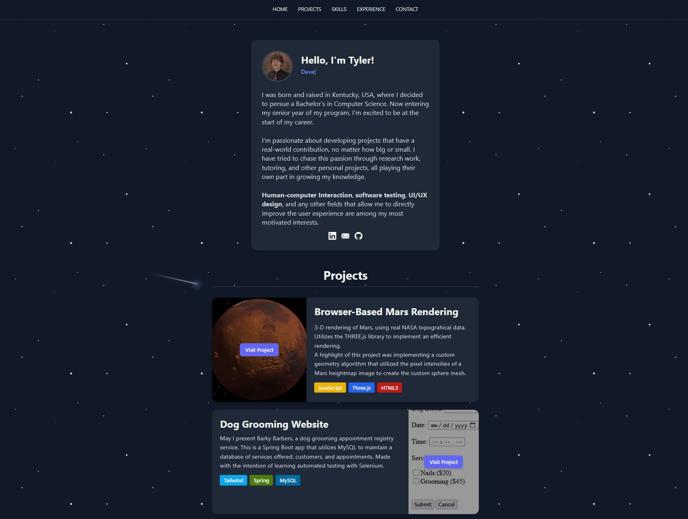

# Personal Portfolio

A portfolio website built with:

- HTML5
- Tailwind CSS
- Vanilla JavaScript

## Features

- Full portfolio with experiences, skills, projects, and more.
- Response web design.
- Background shooting star animation.
- 8-bit alien animation.
- Social media links
- Full website is one html page, hiding all other sections when a navbar selection is made. This allows quick loads, and allows the animation loops to remain on a consistent timer.